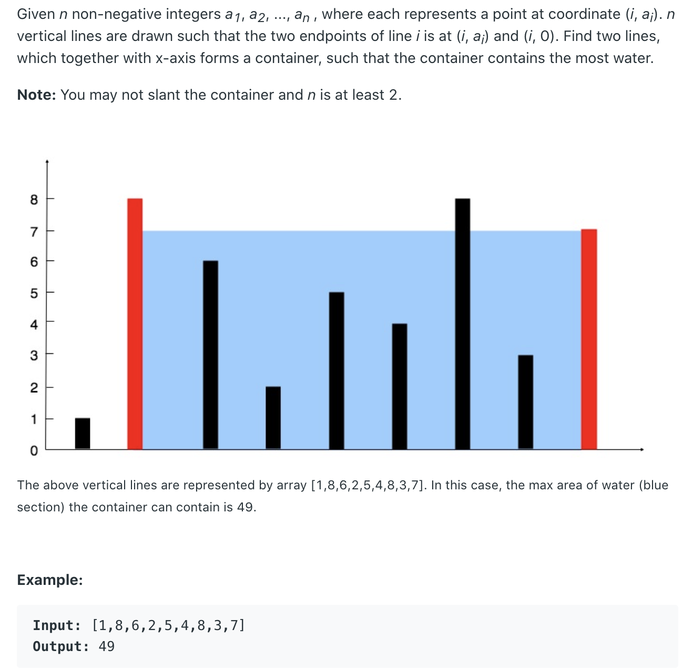

# Container With Most Water

[Container With Most Water](https://leetcode.com/problems/container-with-most-water/)



本来觉得是要用动态规划，可是看了大佬的代码和idea瞬间觉得自己的思路是错的。这个题其实就是变相的求最大面积，我们可以知道长方体的面积是长*高，在遍历这个list的时候长度是一直在减小的，如果长度变小我们只有找到更大的高度才能使面积最大。那么我们可以从两头同时开始遍历，如果`left < right` 那么left向左移，因为我们要找到higher height，如果`left >= right` right向左移就行了。这样就会找到最大的area。

ps：不想想太复杂，试着从最基本的信息去推断，比如这个面积，如果一个变量变下，那另一个变量只有变大才能找到最大的。（😁学习到了）

```java
public int maxArea(int[] height) {
    int max = 0;
    int l = 0, r = height.length-1;

    while (l < r) {
        max = Math.max(max, Math.min(height[l], height[r]) * Math.abs(r - l));
        if (height[l] < height[r]) l ++;
        else r --;
    }

    return max;
}
```