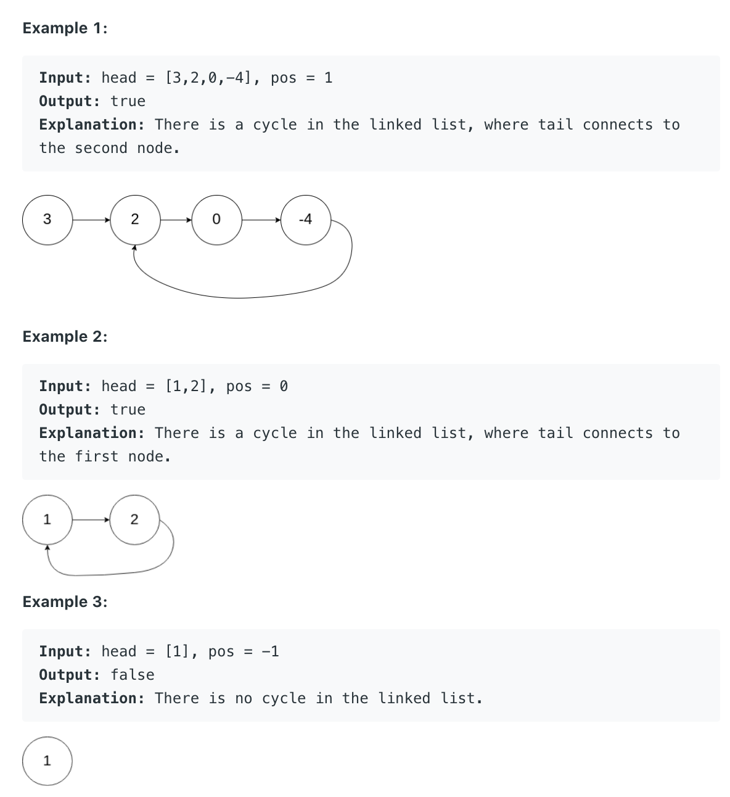

# Linked List Cycle

Given a linked list, determine if it has a cycle in it.

To represent a cycle in the given linked list, we use an integer `pos` which represents the position (0-indexed) in the linked list where tail connects to. If `pos` is `-1`, then there is no cycle in the linked list.



算法思路：

一开始想到的是用HashMap的方式来解决这个问题，但是这样的话空间复杂度就高了很多就是$O(n)$了，然后看了一下大神们的解法，就是利用快慢指针的方法，两种我都试了一下：

1. HashMap的方法

```java
public boolean hasCycle(ListNode head) {
    Map<ListNode, Integer> map = new HashMap<>();

    ListNode curr = head;

    while (curr != null) {
        if (map.containsKey(curr)) return true;
        else map.put(curr, 1);

        curr = curr.next;
    }

    return false;
}
```

2. 快慢指针的方法

   这样效率高，内存占用少

```java
public boolean hasCycle(ListNode head) {
    ListNode slow = head;
    ListNode fast = head;

    while (fast != null && fast.next != null) {
        fast = fast.next.next;
        slow = slow.next;
        
        if (slow == fast) return true;
    }
    return false;
}
```
