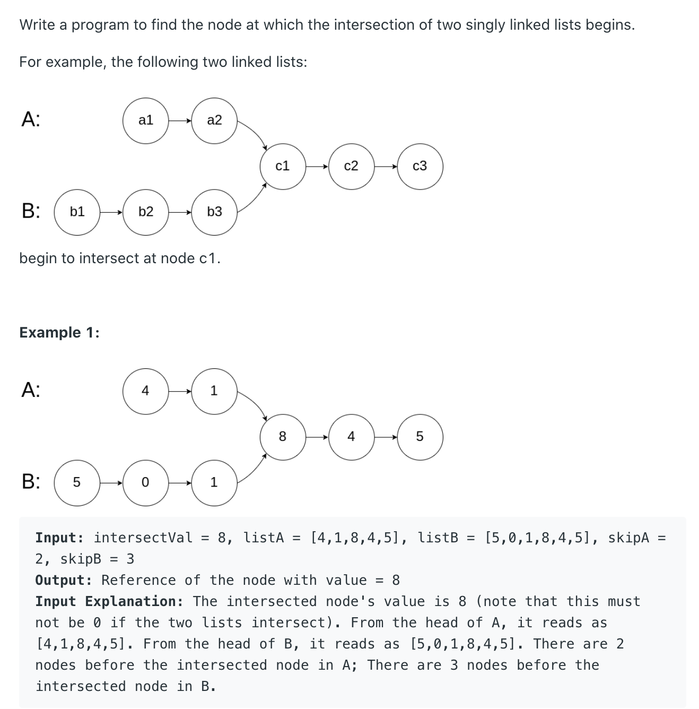

# Intersection of Two Linked Lists

[Intersection of Two Linked Lists](https://leetcode.com/problems/intersection-of-two-linked-lists/)



也算是我第一次面试的第一道题。当时想的是暴力解决，double循环哈哈哈。这次写的时候想到了一个新的方法就是使用HashMap来解决，最坏的情况是$O(n+m)$，不过也比$O(n^2)$好。先把一个LinkList全部放到HashMap里面，然后循环第二个链表，看是不是有一样的node，如果有就直接return当前的node，如果直到循环结束还没有就`return null`

```java
public ListNode getIntersectionNode(ListNode headA, ListNode headB) {
    ListNode head = null;
    ListNode curr = headA;
    Map<ListNode, Integer> map = new HashMap<>();

    while (curr != null) {
        map.put(curr, curr.val);
        curr = curr.next;
    }

    curr = headB;
    while (curr != null) {
        if (map.containsKey(curr)) {
            head = curr;
            break;
        }
        curr = curr.next;
    }

    return head;
}
```

在面试的时候面试官也给我说了另一种解法，就是假设已知两条链表的长度，然后先把两条链表截取到一样的长度，然后一个循环就能找到相对应的结果。这个我觉得时间复杂度比我的要高，就没写。