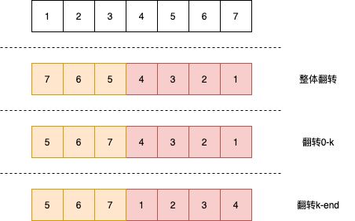

# Rotate Array

[Rotate Array](https://leetcode.com/problems/rotate-array/)

Given an array, rotate the array to the right by *k* steps, where *k* is non-negative.

**Follow up:**

- Try to come up as many solutions as you can, there are at least 3 different ways to solve this problem.
- Could you do it in-place with O(1) extra space?

 

**Example 1:**

```
Input: nums = [1,2,3,4,5,6,7], k = 3
Output: [5,6,7,1,2,3,4]
Explanation:
rotate 1 steps to the right: [7,1,2,3,4,5,6]
rotate 2 steps to the right: [6,7,1,2,3,4,5]
rotate 3 steps to the right: [5,6,7,1,2,3,4]
```

**Example 2:**

```
Input: nums = [-1,-100,3,99], k = 2
Output: [3,99,-1,-100]
Explanation: 
rotate 1 steps to the right: [99,-1,-100,3]
rotate 2 steps to the right: [3,99,-1,-100]
```

就是根据k的个数，每个element向后移动k位，超出array的话在array的开头继续。

刚开始试了好几种方法，但是都不是特别理想，看了一下discussion，学到了。这个翻转链表实际是有规律的，先把整个array reverse一下，然后再把`0-k`reverse，然后把`k-end`reverse一下就可以得到最终的结果。。。很神奇的规律。。。



```java
import java.util.Arrays;

/**
 * 这个想法是在leetcode那边看到的，其工作原理就是先reverse一下
 * 然后在对前k个进行reverse，然后对k-len再reverse
 * 这样就能得到结果了
 */
public class RotateArray {
    public void rotate(int[] nums, int k) {
        if (nums.length < 2 || k < 1) return;
        // 整体反转
        reverse(0, nums.length - 1, nums);

        reverse(0, k % nums.length - 1, nums);
        reverse(k % nums.length, nums.length - 1, nums);
    }

    public void reverse(int left, int right, int[] nums) {
        while (left < right) {
            int temp = nums[left];
            nums[left] = nums[right];
            nums[right] = temp;
            left ++;
            right --;
        }
    }

    public static void main(String[] args) {
        RotateArray re = new RotateArray();
        int[] nums = new int[] {1,2};
        re.rotate(nums, 1);

        System.out.println(Arrays.toString(nums));
    }
}

```
