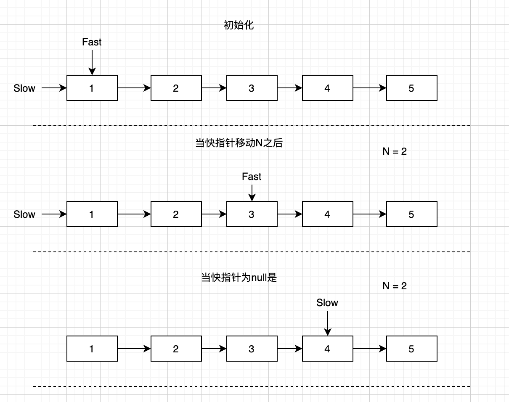

#  Remove Nth Node From End of List

[Remove Nth Node From End of List](https://leetcode.com/problems/remove-nth-node-from-end-of-list/)

Given a linked list, remove the *n*-th node from the end of list and return its head.

**Example:**

```
Given linked list: 1->2->3->4->5, and n = 2.

After removing the second node from the end, the linked list becomes 1->2->3->5.
```

**Note:**

Given *n* will always be valid.

**Follow up:**

Could you do this in one pass?

解析：

题意就是删除倒数第N的节点。这个可以使用一个快慢指针的方法来解决，先让快的指针移动n个node，然后慢的指针开始移动。这样当快的指针为null的时候，慢的指针刚好就是要删除的节点。



其实可以当`fast.next == null`的时候就停止。这样`slow.next = slow.next.next`是一样的，因为我的代码用了`curr`来判断是否为null（删除的元素是不是head）

```java
public class ListNode {
     int val;
     ListNode next;
     ListNode() {}
     ListNode(int val) { this.val = val; }
     ListNode(int val, ListNode next) { this.val = val; this.next = next; }
}

public ListNode removeNthFromEnd(ListNode head, int n) {
    ListNode curr = null;
    ListNode slow = head;
    ListNode fast = head;


    while (fast != null) {
        if (n <= 0) {
            curr = slow;
            slow = slow.next;
        }
        fast = fast.next;
        n --;
    }

    // means at the head
    if(curr == null) head = head.next;
    if (curr != null) curr.next = slow.next;

    return head;
}
```