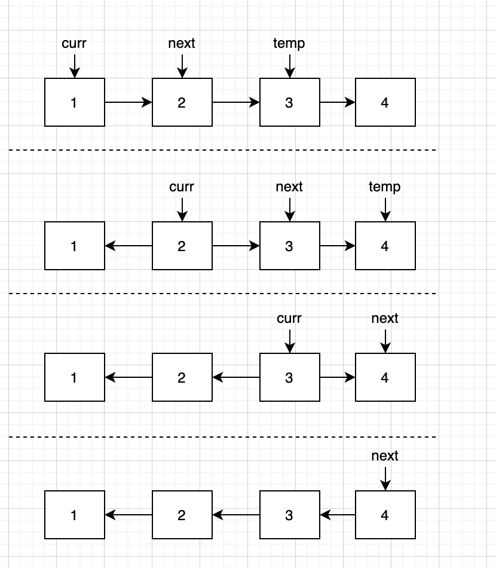
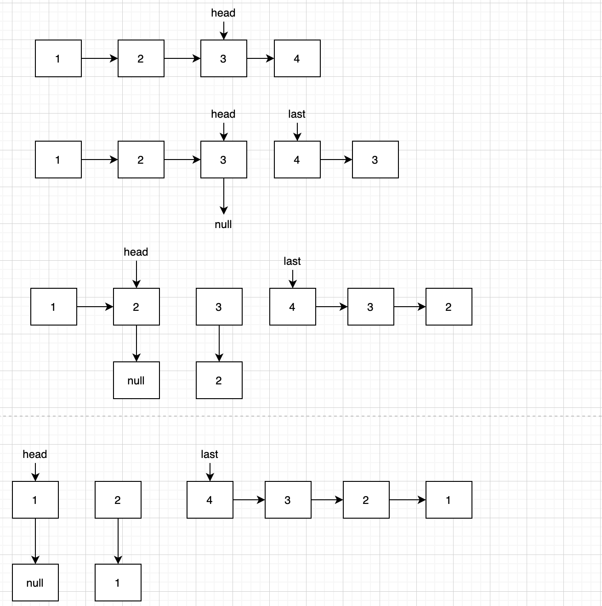

# Reverse Linked List

Reverse a singly linked list.

**Example:**

```
Input: 1->2->3->4->5->NULL
Output: 5->4->3->2->1->NULL
```

翻转链表可以循环实现，也可以用递归实现。



```java
public ListNode reverseList(ListNode head) {
      if (head == null) return null;
      ListNode curr = head;
      ListNode next = head.next;
      ListNode temp = null;
      curr.next = null;


      while (next != null) {
          temp = next.next;
          next.next = curr;
          curr = next;
          next = temp;
      }

      return curr;
}
```

然后递归的话就刚开始看可能不是特别好理解的。总感觉遇到递归就有点懵逼的感觉。。。



```java
public ListNode reverseList(ListNode head) {
    if (head == null || head.next == null) return head;
    ListNode last = reverseList(head.next);

    head.next.next = head;
    head.next = null;

    return last;
}
```
