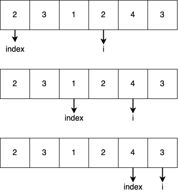

# 209. Minimum Size Subarray Sum
[Minimum Size Subarray Sum](https://leetcode.com/problems/minimum-size-subarray-sum/submissions/): Given an array of positive integers nums and a positive integer target, return the minimal length of a contiguous subarray [numsl, numsl+1, ..., numsr-1, numsr] of which the sum is greater than or equal to target. If there is no such subarray, return 0 instead.

Example:
```
Input: target = 7, nums = [2,3,1,2,4,3]
Output: 2
Explanation: The subarray [4,3] has the minimal length under the problem constraint.
```

## Brute Force
The basic approach is to use two loops to solve that. The time complexity of this approach is $O(N^2)$. It will cause time limit exceeded.
```python
class Solution:
    def minSubArrayLen(self, target: int, nums: List[int]) -> int:
        length = 9999

        for i in range(0, len(nums)):
            res = nums[i]
            if res >= target:
                length = 1
                continue
            for j in range(i + 1, len(nums)):
                res += nums[j]

                if res >= target:
                    length = min(length, j - i + 1)
                    break
        return length if length != 9999 else 0
```

## Advance Approach

To solve this issue, we can use **Sliding Window** to solve this issue. This method is similar to the double pointer. The `index` the left index of this array. When the sum between `i` and `index` is greater or equal to the target, then advance `i` and `index` to find other positions that sum is greater or equal to the target. The basic idea of sliding windows is shown in the Figure.
```python
class Solution:
    def minSubArrayLen(self, target: int, nums: List[int]) -> int:
        index = 0
        res = 0
        min_len = 99999999

        for i in range(0, len(nums)):
            res += nums[i]

            while res >= target:
                length = i - index + 1
                min_len = min(length, min_len)
                res -= nums[index]
                index += 1

        return min_len if min_len != 99999999 else 0
```