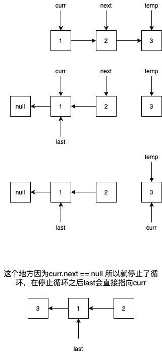

# Swap Nodes in Pairs

Given a linked list, swap every two adjacent nodes and return its head.

You may **not** modify the values in the list's nodes, only nodes itself may be changed.

 

**Example:**

```
Given 1->2->3->4, you should return the list as 2->1->4->3.
```

交换node的位置，两两交换，要考虑的问题有两个，list长度为odd的时候怎么办，怎么去进行loop。



```java
public ListNode swapPairs(ListNode head) {
    if (head == null || head.next == null) return head;
    ListNode curr = head;
    head = curr.next;
    ListNode last = null;

    while (curr != null && curr.next != null) {
        ListNode next = curr.next;
        ListNode temp = next.next;

        if (last != null) {
            last.next = curr.next;
        }
        next.next = curr;
        curr.next = null;
        last = curr;

        curr = temp;
    }

    if (curr != null && curr.next == null) last.next = curr;

    return head;
}
```
