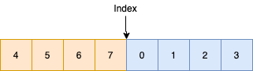

# Search in Rotated Sorted Array

[Search in Rotated Sorted Array](https://leetcode.com/problems/search-in-rotated-sorted-array/)

Suppose an array sorted in ascending order is rotated at some pivot unknown to you beforehand.

(i.e., `[0,1,2,4,5,6,7]` might become `[4,5,6,7,0,1,2]`).

You are given a target value to search. If found in the array return its index, otherwise return `-1`.

You may assume no duplicate exists in the array.

Your algorithm's runtime complexity must be in the order of *O*(log *n*).

**Example 1:**

```
Input: nums = [4,5,6,7,0,1,2], target = 0
Output: 4
```

**Example 2:**

```
Input: nums = [4,5,6,7,0,1,2], target = 3
Output: -1
```

思路，先把分割点找到，就是从哪个地方来做的rotated，比如`[4,5,6,7,0,1,2]`那么分割点就是`index = 3`的时候，因为是一个递增的过程，所以想找到分割点就很简单。再根据分割点做一个binary search，先分析前半段，如果能找到结果就return，如果找不到就找后半段的内容。



```java
public class SearchRotatedArray {
    public int search(int[] nums, int target) {
        if (nums.length == 0) return -1;
        int left = 0;
        int right = nums.length - 1;
        int num = nums[0];
        int mid = -1;

        for (int i = 1; i < nums.length; i ++) {
            if (num <= nums[i]) num = nums[i];
            else {
                mid = i - 1;
                break;
            }
        }

        if (mid == -1) mid = nums.length - 1;
        right = mid;
        int res = binary_search(left, right, nums, target);
        if (res == -1) {
            left = mid + 1; right = nums.length - 1;
            return binary_search(left, right, nums, target);
        } else {
            return res;
        }
    }

    public int binary_search(int left, int right, int[] nums, int target) {

        while (left <= right) {
            int temp_mid = left + (right - left) / 2;
            if (nums[temp_mid] == target) return temp_mid;
            else if (nums[temp_mid] > target) {
                right = temp_mid - 1;
            } else {
                left = temp_mid + 1;
            }
        }
        return -1;
    }

    public static void main(String[] args) {
        int[] nums = new int[] {4,5,6,7,0,1,2};
        SearchRotatedArray s = new SearchRotatedArray();
        int x = s.search(nums, 0);
        System.out.println(x);
    }
}
```
