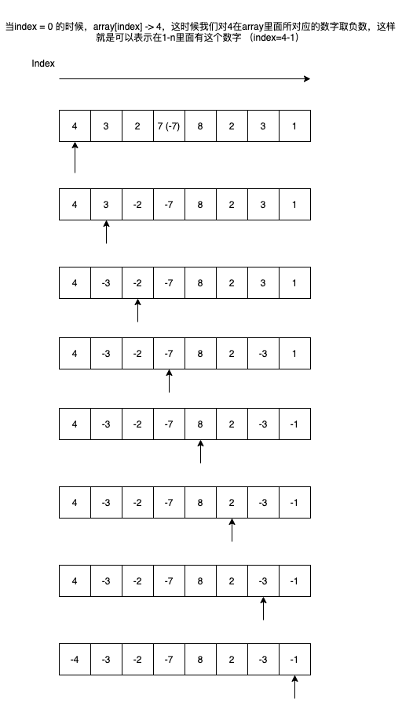

# Find All Numbers Disappeared in an Array

[Find All Numbers Disappeared in an Array](https://leetcode.com/problems/find-all-numbers-disappeared-in-an-array/)

Given an array of integers where 1 ≤ a[i] ≤ *n* (*n* = size of array), some elements appear twice and others appear once.

Find all the elements of [1, *n*] inclusive that do not appear in this array.

Could you do it without extra space and in O(*n*) runtime? You may assume the returned list does not count as extra space.

**Example:**

```
Input:
[4,3,2,7,8,2,3,1]

Output:
[5,6]
```

题解：数组长度1-n，要判断数组里面出现的数字是不是在1-n之间，如果少了哪个数字就给补上。

比如：`[2,2]`数组长度`1-2`，那么改数组少了1。

solution 1：

刚开始考虑的是先sort一下，然后判断index在0，末尾和中间的情况进行补全，但是貌似有点浪费时间了。。所以时间复杂度有点高$O(nlog_{n} + n)$。不过也算是一种方法对吧。。。o(╥﹏╥)o

```java
public List<Integer> findDisappearedNumbers(int[] nums) {
    List<Integer> dis = new LinkedList<>();
    if (nums.length == 0) return dis;
    Arrays.sort(nums);

    int num = nums[0];
    while (num > 1) {
        num --;
        dis.add(num);
    }

    num = nums[0];

    for (int i = 1; i < nums.length; i ++) {
        while (num + 1 != nums[i] && num != nums[i]) {
            num++;
            dis.add(num);
        }
        num = nums[i];
    }

    num = nums[nums.length-1];
    while (num != nums.length) {
        num++;
        dis.add(num);
    }
    return dis;
}
```

solution 2：

看了一下discussion感觉他们写的方法屌爆了。。。因为数组里面的数字是在数组长度`1-n`之内的，所以这个时候我们可以做一个指示器的格式，把数组里面每个数字所对应的坐标变成负数，然后再寻找一个array里面哪些是负数。很欢喜。。



```java
public List<Integer> findDisappearedNumbers(int[] nums) {
    List<Integer> dis = new LinkedList<>();
    if (nums.length == 0) return dis;

    for (int i = 0; i < nums.length; i ++) {
        int index = Math.abs(nums[i]) - 1;
        if (nums[index] > 0) {
            nums[index] = -nums[index];
        }
    }

    for (int i = 0; i < nums.length; i ++) if (nums[i] > 0) dis.add(i + 1);

    return dis;
}
```