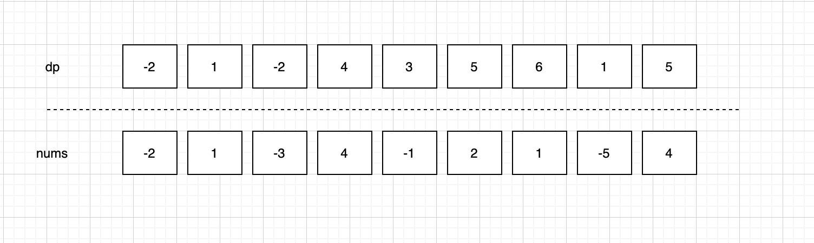

# Maximum Subarray

[Maximum Subarray](https://leetcode.com/problems/maximum-subarray/)

Given an integer array `nums`, find the contiguous subarray (containing at least one number) which has the largest sum and return its sum.

**Example:**

```
Input: [-2,1,-3,4,-1,2,1,-5,4],
Output: 6
Explanation: [4,-1,2,1] has the largest sum = 6.
```

**Follow up:**

If you have figured out the O(*n*) solution, try coding another solution using the divide and conquer approach, which is more subtle.

题意解析：找到和最大的子序列。

算法解析：

可以使用动态规划来做。初始化一个数组长度和原数组一样，如果`i-1`的数字小于零就表示这就不用需要进行加和，因为加负数就是在减小，然后把`i`就行赋值。在每次循环的时候找到最大的值就行（`max`,`dp[i]`取最大的）。`dp[i]`存的结果：如果`dp[i-1]`小于零那就是本身，不然就是`dp[i-1] + num[i]`加上当前数字。



```java
public int maxSubArray(int[] nums) {
    int max = nums[0];
    int[] dp = new int[nums.length];
    dp[0] = nums[0];

    for (int i = 1; i < nums.length; i ++) {
        if (dp[i-1] < 0) {
            dp[i] = nums[i];
        } else {
            dp[i] = dp[i-1] + nums[i];
        }
        max = Math.max(dp[i], max);
    }
    return max;
}
```

看了大佬的思路之后发现了新天地，可以节省一些内存空间，降低空间复杂度：

只需要两个空间的位置就行了，因为我们只需要`i`和`i-1`这两个参数。

```java
public int maxSubArray(int[] nums) {
    int max = nums[0];
    int[] temp = new int[2];
    temp[0] = nums[0];

    for (int i = 1; i < nums.length; i ++) {
        if (temp[(i - 1) % 2] >= 0) {
            temp[i % 2] = temp[(i-1) % 2] + nums[i];
            max = Math.max(temp[i%2], max);
        } else {
            temp[i % 2] = nums[i];
        }
    }

    return max;
}
```
