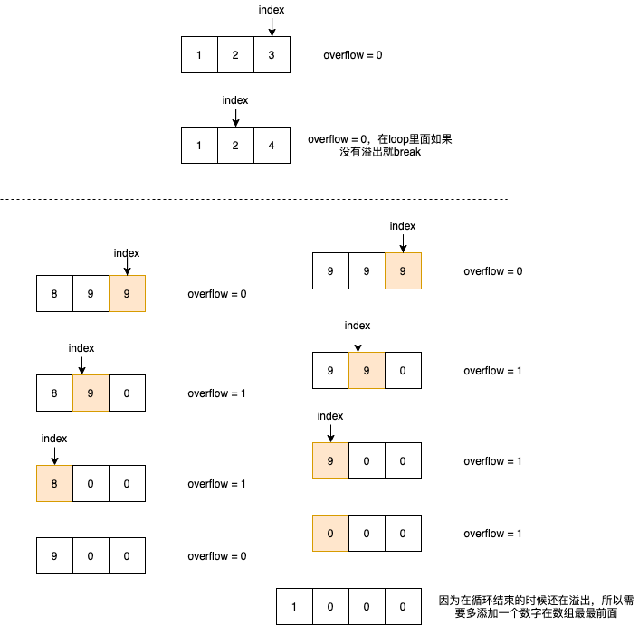

# Plus One

Given a **non-empty** array of digits representing a non-negative integer, plus one to the integer.

The digits are stored such that the most significant digit is at the head of the list, and each element in the array contain a single digit.

You may assume the integer does not contain any leading zero, except the number 0 itself.

**Example 1:**

```
Input: [1,2,3]
Output: [1,2,4]
Explanation: The array represents the integer 123.
```

**Example 2:**

```
Input: [4,3,2,1]
Output: [4,3,2,2]
Explanation: The array represents the integer 4321.
```

一个数学的问题，在最后面加1，然后如果大于10，那么前面的数字就需要加一。可以直接不用分类来讨论，我们可以设置一个循环`index <= 0` ，`index = nums.length - 1`这样我们从最后面开始加1，`overflow`是用来判断是否溢出，在循环里面如果没有溢出，就表示前面数字加一的结果不大于10，所以可以直接break。还有一种如果循环结束了依然溢出了，这时候我们需要在array里面多加一个数字在最前面。



```java
import java.util.Arrays;
import java.util.stream.IntStream;

public class PlusOne {
    public int[] plusOne(int[] digits) {
        int lens = digits.length - 1;
        int[] nums = digits.clone();
        int overflow = 0;
        nums[lens] += 1;

        while (lens != -1) {
            // every time plus one
            nums[lens] += overflow;
            overflow = nums[lens] / 10;
            if (nums[lens] > 9) nums[lens] %= 10;
            lens --;
            // 当不溢出的时候就可以break了，因为不会进位了
            if (overflow == 0) break;
        }

        // 如果循环结束还溢出，说明还需要多开辟一个内存位置。
        if (overflow != 0) {
            nums = IntStream.concat(Arrays.stream(new int[] {1}), Arrays.stream(nums)).toArray();
        }
        return nums;
    }

    public static void main(String[] args) {
        int[] nums = new int[] {8,9};
        PlusOne p = new PlusOne();
        int[] res = p.plusOne(nums);
        System.out.println(Arrays.toString(res));
    }
}

```