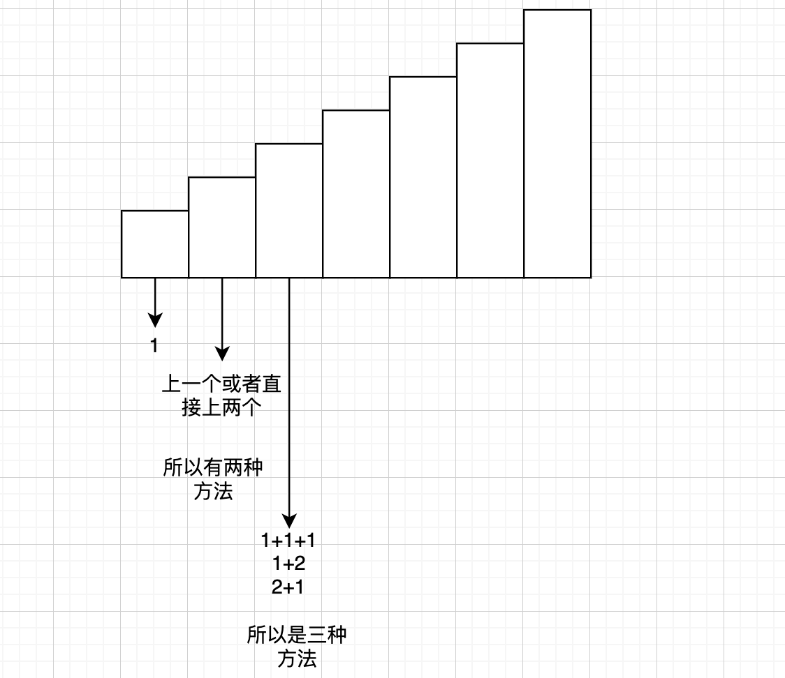

# Climbing Stairs

[Climbing Stairs](https://leetcode.com/problems/climbing-stairs/)

You are climbing a stair case. It takes *n* steps to reach to the top.

Each time you can either climb 1 or 2 steps. In how many distinct ways can you climb to the top?

**Note:** Given *n* will be a positive integer.

**Example 1:**

```
Input: 2
Output: 2
Explanation: There are two ways to climb to the top.
1. 1 step + 1 step
2. 2 steps
```

**Example 2:**

```
Input: 3
Output: 3
Explanation: There are three ways to climb to the top.
1. 1 step + 1 step + 1 step
2. 1 step + 2 steps
3. 2 steps + 1 step
```

这是一个很经典的动态规划的问题。一次可以走一阶楼梯或者两阶楼梯。在第一层的时候肯定只能上一阶，第二层的时候可以是1+1（连续走两个一阶）或者2（直接两阶）所以是两种方法，第三层的时候可以是1+1+1, 1+2, 2+1三种方法。所以可以看出$f(n)=f(n-1)+f(n-2)$的算法。



```java
public int climbStairs(int n) {
    if (n == 1) return 1;
    if (n == 2) return 2;
    int[] array = new int[n];
    array[0] = 1;
    array[1] = 2;

    for (int i = 2; i < n; i ++ ){
        array[i] = array[i-1] + array[i-2];
    }

    return array[n-1];
}
```