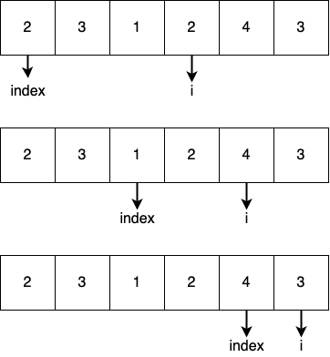

# 77. Combinations
Given two integers `n` and `k`, return all possible combinations of `k` numbers out of the range `[1, n]`. You may return the answer in any order. For example
```
Input: n = 4, k = 2
Output:
[
  [2,4],
  [3,4],
  [2,3],
  [1,2],
  [1,3],
  [1,4],
]
```

It is pretty hard to use loop to solve this issue. Beacause the `k` determine the number of nested loop, when `k=2` then it should have three nested loop. However, when k in not a const number, then we can not determine how many loops we need.

Therefore, we can use recursion to do this kind of issues. We can seen it as a tree as shown in the Figure. The root node is `1-n` and the deep is `k`. Pick up the number from left to right without repeating. We can set up a `path` to record the visited path, and when the length of `path` is equal to `k` then add the `path` to result.



```python
class Solution:
    def combine(self, n: int, k: int) -> List[List[int]]:
        def back_tracking(n, k, index, path, result):
            if len(path) == k:
                result.append([i for i in path])
                return path

            for i in range(index + 1, n + 1):
                path.append(i)
                back_tracking(n, k, i, path, result)
                path.pop()

            return result
        
        return back_tracking(n, k, 0, [], [])
```
