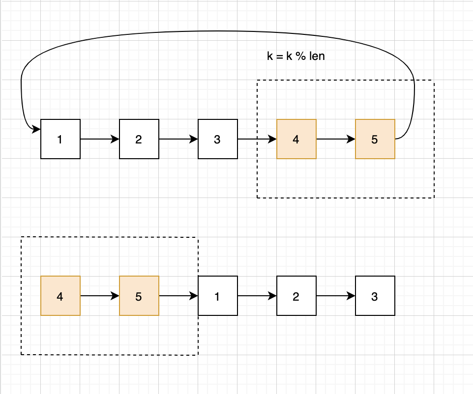

# 82. Remove Duplicates from Sorted List II

Given a sorted linked list, delete all nodes that have duplicate numbers, leaving only *distinct* numbers from the original list.

Return the linked list sorted as well.

**Example 1:**

```
Input: 1->2->3->3->4->4->5
Output: 1->2->5
```

**Example 2:**

```
Input: 1->1->1->2->3
Output: 2->3
```

这个第[83](https://leetcode.com/problems/remove-duplicates-from-sorted-list/)的进阶版。只要是有重复的node都需要删除掉。我们需要有一个node（last）来记录上一个访问的node，一个node（curr）来循环。如果`curr.val == curr.next.val`就代表着有重复的node了，这时候找到所有重复的node，然后得到最后一个重复node的next，然后使用last链接就行，但是last需要判断是否是null，如果是null的话需要考虑到head的情况。



```java
public class RemoveDuplicatesfromSortedListII {
    public static class ListNode {
        int val;
        ListNode next;
        ListNode() {}
        ListNode(int val) { this.val = val; }
        ListNode(int val, ListNode next) { this.val = val; this.next = next; }
    }

    public ListNode deleteDuplicates(ListNode head) {
        if (head == null || head.next == null) return head;

        ListNode last = null;
        ListNode curr = head;

        while (curr.next != null) {
            if (curr.val == curr.next.val) {
                ListNode node = different(curr);
                if (last == null) {
                    head = node;
                } else {
                    last.next = node;
                }
                curr = node;
                if (curr == null) break;
                continue;
            } else {
                last = curr;
            }
            curr = curr.next;
        }

        return head;
    }

    public ListNode different(ListNode node) {
        ListNode last = node;
        while (node.next != null) {
            if (node.val != node.next.val) {
                return node.next;
            }
            last = node;
            node = node.next;
        }
        // 因为是node.next != null 所以需要判断最后一个node是不是和前面的相等
        if (last.val == node.val) return null;
        return node;
    }

    public static void main(String[] args) {
        ListNode l1 = new ListNode(1);
        ListNode l2 = new ListNode(2);
        ListNode l3 = new ListNode(2);
        ListNode l4 = new ListNode(2);
//        ListNode l5 = new ListNode(5);

        l1.next = l2;
        l2.next = l3;
        l3.next = l4;
//        l4.next = l5;

        RemoveDuplicatesfromSortedListII r = new RemoveDuplicatesfromSortedListII();
        r.deleteDuplicates(l1);
    }
}
```