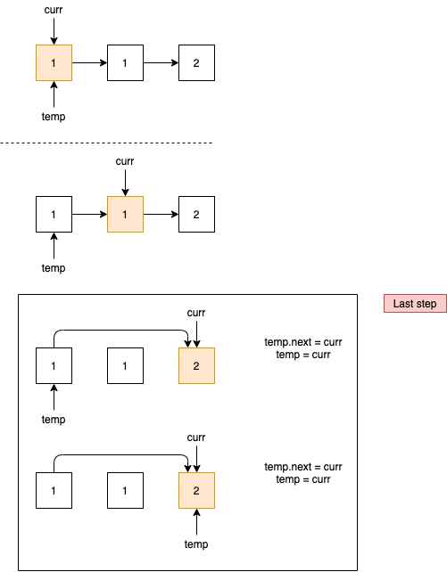

# 83. Remove Duplicates from Sorted List

Given a sorted linked list, delete all duplicates such that each element appear only *once*.

**Example 1:**

```
Input: 1->1->2
Output: 1->2
```

**Example 2:**

```
Input: 1->1->2->3->3
Output: 1->2->3
```

在已经sorted的链表里面去除重复的值，可以使用连个指针来完成，curr来前进，temp来链接不一样的值。当`temp.val != curr.val`的时候代表中间已经省略了同类项，所以直接设置`temp.next = curr`然后把curr赋值给temp（`temp = curr`）。



```java
public class RemoveDuplicatesfromSortedList {
    public static class ListNode {
        int val;
        ListNode next;
        ListNode() {}
        ListNode(int val) { this.val = val; }
        ListNode(int val, ListNode next) { this.val = val; this.next = next; }
    }

    public ListNode deleteDuplicates(ListNode head) {
        if (head == null || head.next == null) return head;

        ListNode curr = head.next;
        ListNode temp = head;

        while (curr != null) {
            if (temp.val != curr.val) {
                temp.next = curr;
                temp = curr;
            }
            curr = curr.next;
        }
        temp.next = null;

        return head;
    }


    public static void main(String[] args) {
        ListNode l1 = new ListNode(1);
        ListNode l2 = new ListNode(1);
        ListNode l3 = new ListNode(2);

        l1.next = l2;
        l2.next = l3;
        l3.next = null;

        RemoveDuplicatesfromSortedList re = new RemoveDuplicatesfromSortedList();
        ListNode head = re.deleteDuplicates(l1);

        while (head != null) {
            System.out.println(head.val);
            head = head.next;
        }
    }

}
```