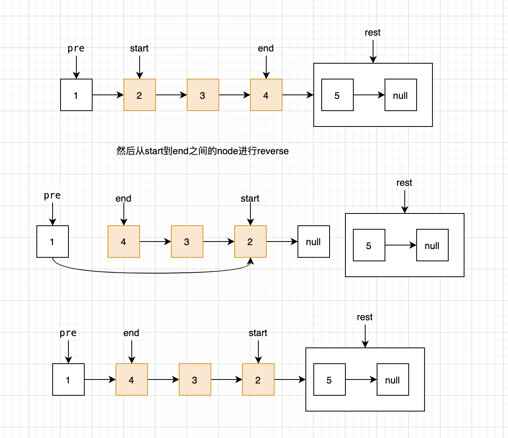

# 92. Reverse Linked List II

Reverse a linked list from position *m* to *n*. Do it in one-pass.

**Note:** 1 ≤ *m* ≤ *n* ≤ length of list.

**Example:**

```
Input: 1->2->3->4->5->NULL, m = 2, n = 4
Output: 1->4->3->2->5->NULL
```

从起始点到结束点进行reverse。首先根据`curr`的index遍历到`m`的时候记录一下该node `start`，然后同时记录start前面的一个node `pre`因为reverse结束还要把链表链接起来。当index遍历到`n`的时候记录该node `end`。然后使用递归进行reverse。



```java
public class ReverseLinkedListII {
    public static class ListNode {
        int val;
        ListNode next;
        ListNode() {}
        ListNode(int val) { this.val = val; }
        ListNode(int val, ListNode next) { this.val = val; this.next = next; }
    }

    public ListNode reverseBetween(ListNode head, int m, int n) {
        if (m >= n || head == null || head.next == null) return head;

        int index = 1;
        ListNode curr = head;
        ListNode start = null;
        ListNode end = null;
        ListNode pre = null;

        while (curr != null) {
            if (index == m) start = curr;
            if (index == n) end = curr;
            if (start == null) pre = curr;
            curr = curr.next;
            ++index;
        }

        if (end == null || start == null) return head;

        ListNode rest = end.next;
        end.next = null;
        reverse(start, start.next);
        // 现在endu应该是head

        if (pre == null) head = end;
        else pre.next = end;

        start.next = rest;

        return head;
    }

    public void reverse(ListNode curr, ListNode next) {
        if (next == null) return;

        reverse(next, next.next);
        next.next = curr;
        curr.next = null;
    }

    public static void main(String[] args) {
        ListNode l1 = new ListNode(1);
        ListNode l2 = new ListNode(2);
        ListNode l3 = new ListNode(3);
        ListNode l4 = new ListNode(4);
        l1.next = l2;
        l2.next = l3;
        l3.next = l4;

        ReverseLinkedListII r = new ReverseLinkedListII();
        r.reverseBetween(l1, 1, 4);
    }
}
```
